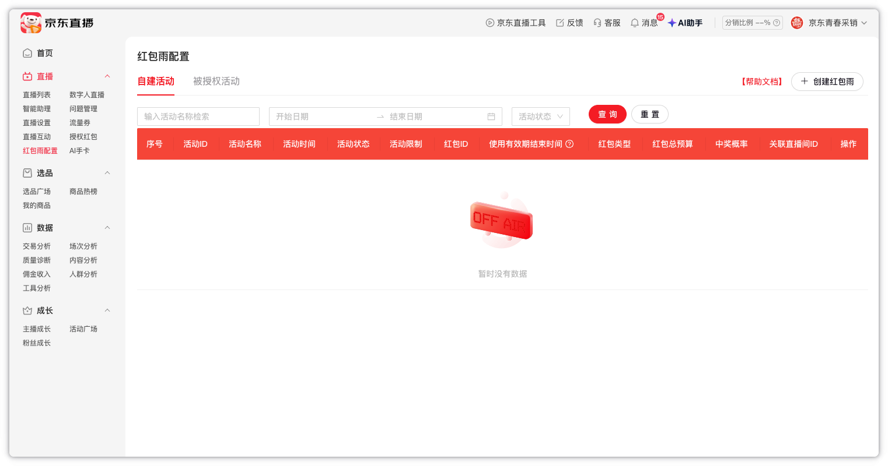
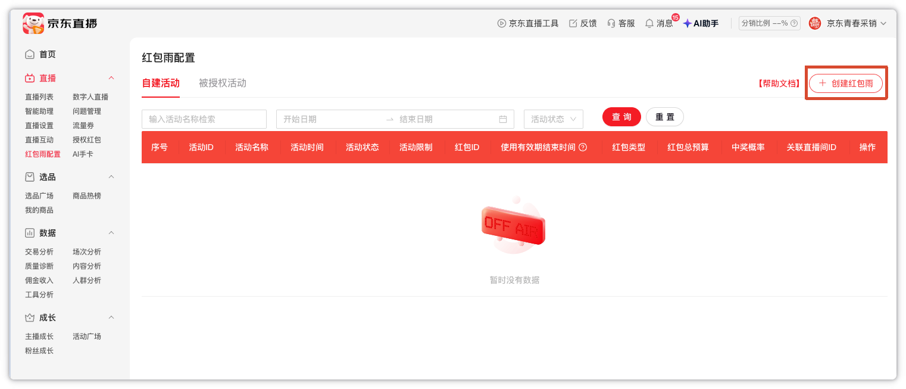
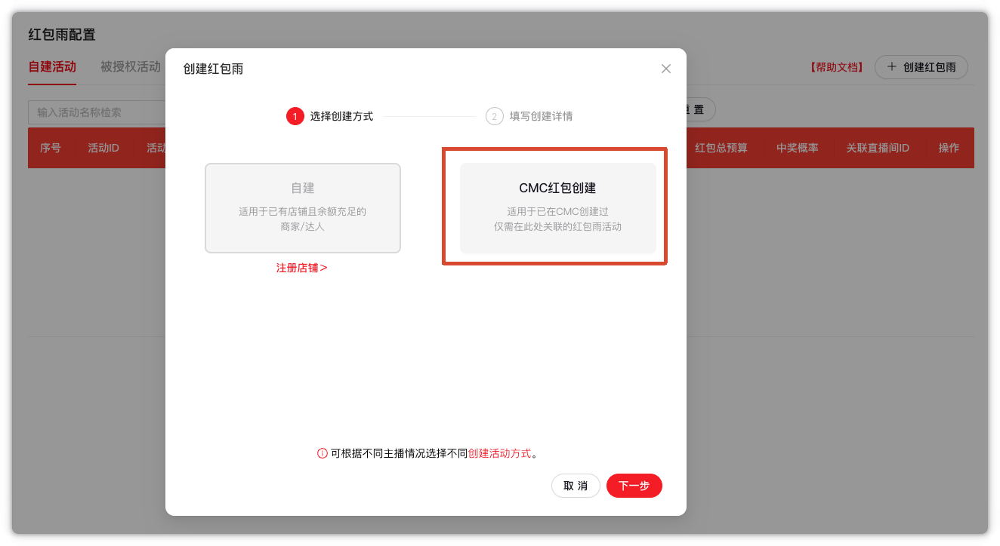
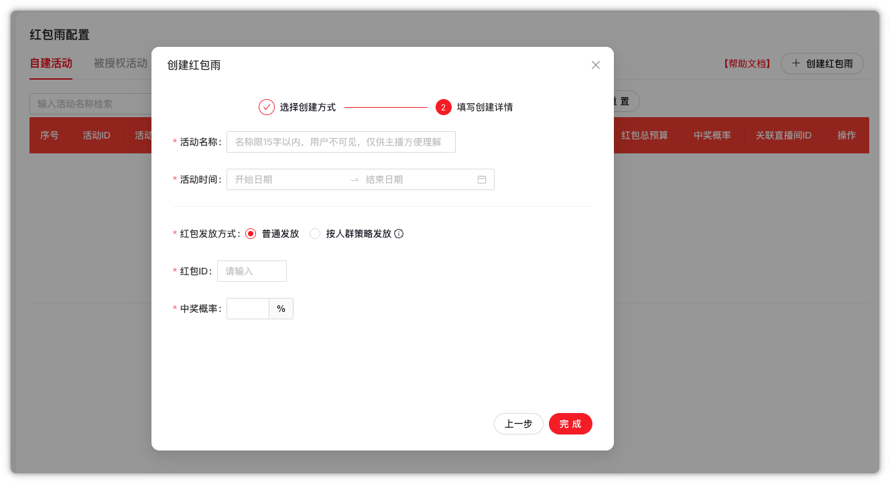

# 直播-自动创建红包雨-SOP

## 一、功能目标

在直播运营工具中新增“自动创建红包雨”功能。用户上传维护好红包雨信息的 Excel，工具完成数据预校验后，自动登录京东直播后台，逐行创建 CMC 红包雨活动，并生成包含成功、失败及失败原因的结果文件。

红包雨配置页面：

- <https://jlive.jd.com/my/redRain>

> 本 SOP 的页面字段和交互规则已于 2026-07-20 使用已登录的京东直播账号实际核对。调研过程中只进入创建详情页，没有点击“完成”，未创建真实红包雨活动。

## 二、Excel 输入要求

### 2.1 字段说明

| 字段 | 是否必填 | 填写要求 |
| --- | --- | --- |
| 活动名称 | 是 | 最多 15 个字；仅供主播识别，用户端不可见 |
| 开始时间 | 是 | 建议格式：`2026-07-20 20:00:00` |
| 结束时间 | 是 | 建议格式：`2026-07-20 20:10:00`，必须晚于开始时间 |
| 红包发放方式 | 是 | 仅支持“普通发放”或“按人群策略发放” |
| 红包ID | 是 | 填写在 CMC 创建红包后取得的红包 ID |
| 中奖概率 | 条件必填 | 普通发放必填，建议填写 `1～100`；按人群策略发放时留空 |

### 2.2 两种发放方式的差异

#### 普通发放

- 页面默认选择“普通发放”。
- 红包 ID 必填。
- 中奖概率必填。
- 中奖概率按整数填写，最大值为 `100`；页面输入超过 `100` 时会自动调整为 `100`。
- 页面输入 `0` 时暂未立即提示错误，但工具侧应按有效概率预校验为 `1～100`，避免提交时失败。

#### 按人群策略发放

- 仅主播等级达到 3 级及以上的主播可使用。
- 选择后页面会隐藏“中奖概率”字段，因此 Excel 中该行的中奖概率应留空。
- 人群策略红包需提前在 CMC 按对应规则完成创建，再将取得的红包 ID 填入 Excel。

### 2.3 Excel 示例

| 活动名称 | 开始时间 | 结束时间 | 红包发放方式 | 红包ID | 中奖概率 |
| --- | --- | --- | --- | --- | --- |
| 7月20日晚场红包雨 | 2026-07-20 20:00:00 | 2026-07-20 20:10:00 | 普通发放 | 123456789 | 50 |
| 7月20日会员红包雨 | 2026-07-20 21:00:00 | 2026-07-20 21:10:00 | 按人群策略发放 | 987654321 |  |

## 三、创建前业务检查

批量创建前应先对整份 Excel 做预校验。校验不通过的行不进入浏览器创建流程，并在结果文件中记录失败原因。

需要检查：

1. 必填字段是否完整。
2. 活动名称是否超过 15 个字。
3. 开始时间、结束时间是否能正确识别，且结束时间是否晚于开始时间。
4. 红包发放方式是否为允许值。
5. 普通发放的中奖概率是否为 `1～100` 的整数。
6. 按人群策略发放的中奖概率是否为空。
7. Excel 内是否存在完全重复的记录。
8. Excel 内各红包雨活动时间是否重叠。
9. 红包 ID 是否重复。建议一个红包 ID 只用于一场红包雨。

官方规则说明：

- 每场红包雨活动的生效时间不可重复。
- 活动开始前约 30 分钟，直播间内开始展示活动入口。
- 活动时间区间内用户可以参与，活动结束后入口消失。
- CMC 中配置的红包有效期应晚于红包雨活动结束时间，并与直播运营计划匹配。

## 四、京东直播后台操作流程

### 4.1 进入红包雨配置页面

登录京东直播系统，进入“直播”→“红包雨配置”，或者直接访问：

- <https://jlive.jd.com/my/redRain>

列表页支持按活动名称、活动时间和活动状态查询。列表会展示：

- 活动ID
- 活动名称
- 活动时间
- 活动状态
- 活动限制
- 红包ID
- 使用有效期结束时间
- 红包类型
- 红包总预算
- 中奖概率
- 关联直播间ID
- 操作

### 4.2 点击“创建红包雨”

点击页面右上角“创建红包雨”。

### 4.3 选择创建方式

选择“CMC红包创建”，然后点击“下一步”。

页面提供两种创建方式：

- 自建：适用于已有店铺且余额充足的商家或达人。
- CMC红包创建：适用于已经在 CMC 创建好红包，只需在直播后台关联红包雨活动的场景。

本功能固定使用“CMC红包创建”。实际调研账号下“自建”不可用，“CMC红包创建”可用。

### 4.4 填写创建详情

依次填写：

1. 活动名称。
2. 活动开始时间和结束时间，页面支持选择到秒。
3. 红包发放方式。
4. 红包 ID。
5. 普通发放时填写中奖概率；按人群策略发放时页面不显示中奖概率。
6. 检查无误后点击“完成”。

> “完成”会真实创建红包雨活动。自动化运行时必须在提交前完成单行校验，不能把校验失败的数据带到该步骤。

## 五、自动化批量创建流程

直播运营工具建议按以下顺序执行：

1. 用户上传 `.xlsx` 文件。
2. 工具读取表头并确认字段映射。
3. 对整份 Excel 做预校验，区分可执行行和校验失败行。
4. 启动浏览器并复用直播运营工具已有的京东登录态。
5. 启动时或批处理中途登录态失效时，暂停当前行，切换到可见浏览器提示用户完成登录；登录恢复后重新执行当前行。
6. 逐行串行创建红包雨：
   - 进入红包雨配置页。
   - 点击“创建红包雨”。
   - 选择“CMC红包创建”。
   - 填写当前行数据。
   - 提交并判断成功或失败。
7. 单行失败时记录原因，关闭当前弹窗并继续处理下一行；登录失效或用户主动停止时中断任务。
8. 全部处理结束后生成结果 Excel，供用户下载。

## 六、防止重复创建

红包雨创建属于真实业务写操作。工具中断后直接重新运行，可能造成重复活动，因此需要增加幂等保护。

建议在每行提交前，先根据以下信息查询现有红包雨活动：

- 活动名称
- 活动开始时间和结束时间
- 红包 ID

如果已经存在相同活动，当前行应标记为“已存在，未重复创建”，不能再次点击“完成”。

点击“完成”后如果页面弹窗已经关闭、但列表暂时没有刷新出新活动，当前行应标记为“待确认”，不能直接记为失败。工具会按“活动名称 + 完整开始时间 + 完整结束时间 + 发放方式 + 红包 ID”记录 7 天本地提交保护；保护期内再次运行相同活动时不会重复点击“完成”，需要先到后台确认真实创建结果。

Excel 内部的重复行、重复红包 ID 和重叠活动时间，也应在打开浏览器前直接拦截。

## 七、结果文件要求

结果文件应保留用户上传的原始字段，并追加以下结果列：

| 结果字段 | 说明 |
| --- | --- |
| 原始行号 | 对应上传 Excel 的行号 |
| 创建状态 | 成功、失败、跳过、已存在或待确认 |
| 活动ID | 创建成功后尽量记录页面返回的活动 ID |
| 失败原因 | 校验失败、登录失效、红包 ID 无效、时间冲突、账号无权限、页面提交失败等 |

页面还应展示：

- 当前进度/总数
- 成功数量
- 失败数量
- 跳过数量
- 当前处理的活动名称
- 实时日志
- 停止创建按钮
- 下载结果按钮

## 八、已确认与待验证边界

### 8.1 已确认

- 红包雨配置页面可使用当前京东账号正常访问。
- 当前账号可以选择“CMC红包创建”。
- 活动名称、活动时间、红包发放方式、红包 ID 和中奖概率等页面控件已实际核对。
- 普通发放与按人群策略发放的页面字段不同。
- 按人群策略发放时，中奖概率字段会被隐藏。
- 活动时间选择器支持年、月、日、时、分、秒。
- 普通发放中奖概率最大为 `100`。
- 使用直播运营工具刚刷新的 `jd_auth.json` 登录态，自动化已能在无头浏览器中正常进入红包雨列表页。
- 自动化已实际验证活动名称查询、CMC 创建弹窗、活动时间（精确到秒）、普通发放、红包 ID 和中奖概率控件的定位及填写。
- 填写完成后“完成”按钮可用；本次验证主动关闭弹窗，没有点击“完成”，没有创建测试活动。

### 8.2 待真实数据验证

以下内容必须使用一条允许真实创建的 CMC 红包 ID 进行单条验证：

1. 点击“完成”后的成功提示和页面变化。
2. 创建成功后活动 ID的取得方式。
3. 红包 ID 不存在、已使用、已过期或与发放方式不匹配时的真实报错文案。
4. 后台对中奖概率最小值及小数的最终校验规则。
5. 创建成功后活动在列表中的刷新时间及查询方式。

完成单条真实验证后，再开放批量创建功能。
